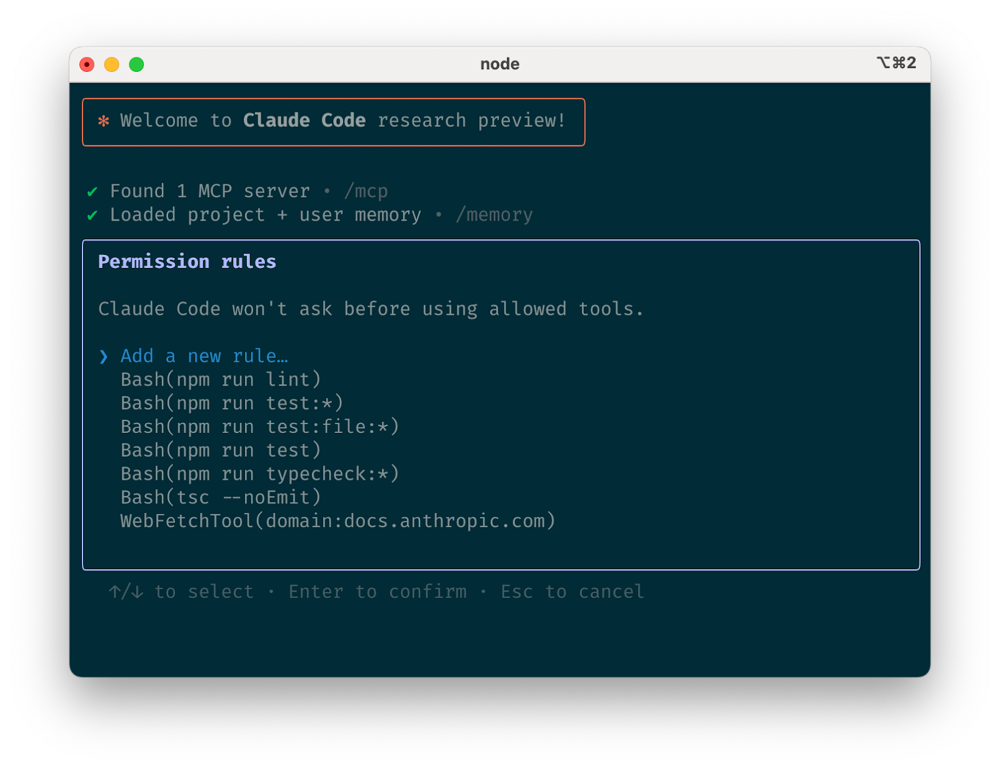
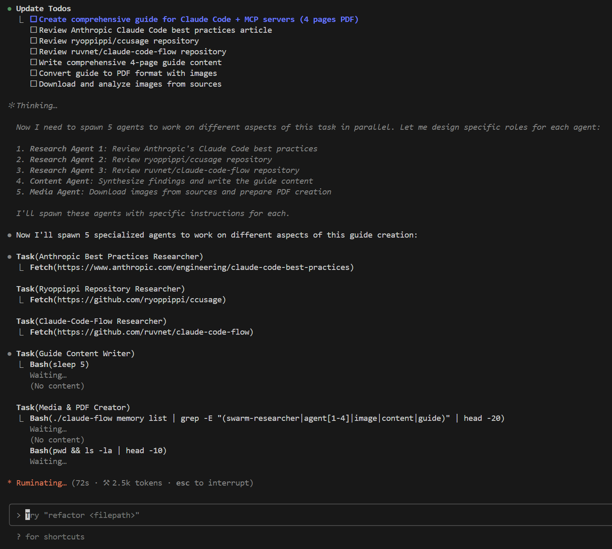
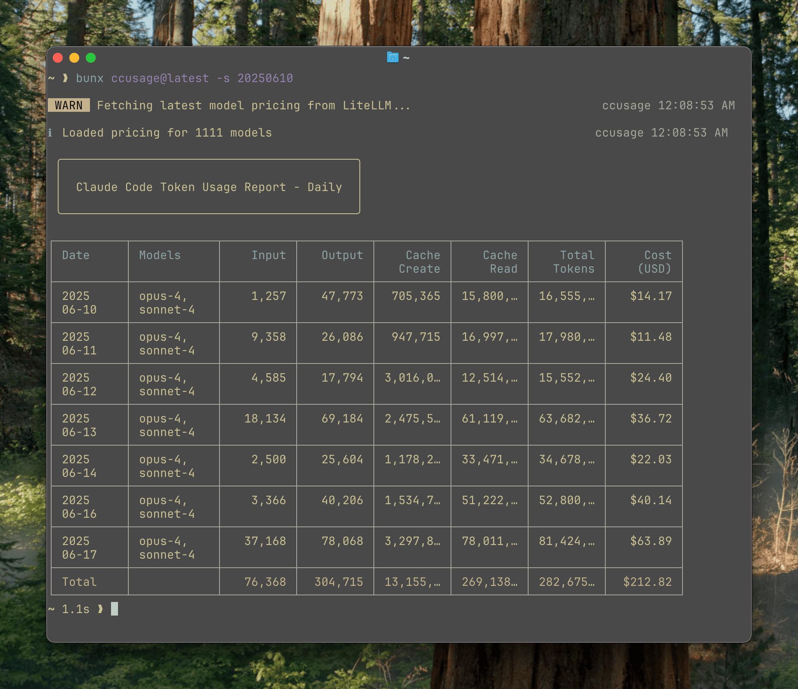
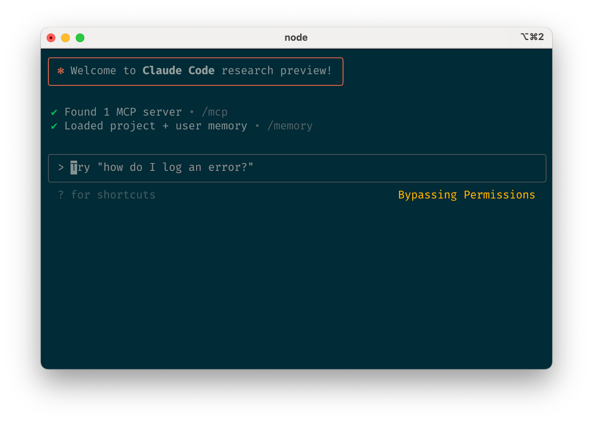

# Claude Code + MCP Integration Guide

<p align="center">
  
</p>

<p align="center">
  <strong>The Complete Developer's Guide to Claude Code with MCP Servers</strong><br>
  <em>Accelerate your development workflow with AI-powered coding assistance</em>
</p>

<p align="center">
  <a href="#quick-start">Quick Start</a> •
  <a href="#documentation">Documentation</a> •
  <a href="#pricing">Pricing</a> •
  <a href="#examples">Examples</a> •
  <a href="#community">Community</a>
</p>

---

## 🚀 Overview

Claude Code is Anthropic's official CLI tool for AI-assisted development. This standalone command-line interface brings Claude's capabilities directly to your terminal and development workflows. Combined with MCP (Model Context Protocol) servers, it creates a powerful AI-enhanced coding environment.

### Why Claude Code + MCP?

- **10x Development Speed**: Multi-agent orchestration accelerates complex tasks
- **Universal Integration**: Connect to any data source, API, or tool via MCP
- **Intelligent Scaling**: From simple scripts to enterprise architectures
- **Persistent Knowledge**: Cross-session memory and context retention
- **Extended Thinking**: Deep reasoning for complex problems

## 📚 Documentation

### Getting Started
- [Installation & Setup](docs/01-installation-setup.md)
- [Quick Start Guide](docs/02-quick-start.md)
- [Basic Commands](docs/03-basic-commands.md)

### Core Concepts
- [Understanding Claude Code](docs/04-understanding-claude-code.md)
- [MCP (Model Context Protocol)](docs/05-mcp-protocol.md)
- [Extended Thinking Modes](docs/06-extended-thinking.md)

### Development Workflows
- [SPARC Development Modes](docs/07-sparc-modes.md)
- [Multi-Agent Orchestration](docs/08-multi-agent-orchestration.md)
- [Development Workflows](docs/09-development-workflows.md)

### Advanced Topics
- [Enterprise Integration](docs/10-enterprise-integration.md)
- [Cost Management & Monitoring](docs/11-cost-management.md)
- [Best Practices](docs/12-best-practices.md)

### Reference
- [Command Reference](docs/13-command-reference.md)
- [Troubleshooting](docs/14-troubleshooting.md)
- [Examples & Recipes](docs/15-examples-recipes.md)
- [API & SDK Reference](docs/16-api-sdk-reference.md)

## 💰 Pricing

Claude Code uses the Anthropic API pricing model:

| Plan | Price | API Usage | Model Access | Best For |
|------|-------|-----------|--------------|----------|
| **Free Tier** | $0 | Limited monthly credits | Sonnet models | Testing & learning |
| **Pro** | $20/mo | Higher rate limits | Sonnet 4 | Small projects |
| **Max** | Varies | Enterprise limits | All models | Production use |

**API Token Pricing:**
- **Sonnet 4**: $3/1M input tokens, $15/1M output tokens
- **Opus 4**: $15/1M input tokens, $75/1M output tokens

## 🚀 Quick Start

```bash
# Install Claude Code CLI
npm install -g @anthropic-ai/claude-code

# Set up authentication
export ANTHROPIC_API_KEY="sk-ant-api03-..."

# Start interactive session
claude

# Optional: Enhanced features with Claude-Flow
git clone https://github.com/ruvnet/claude-code-flow
cd claude-code-flow
./claude-flow init --sparc

# Your first swarm command
./claude-flow swarm "Build a REST API with authentication" \
  --strategy development \
  --max-agents 5 \
  --parallel
```

## 🌟 Key Features

### 📋 Task Management & Multi-Agent Orchestration

<p align="center">
  
</p>

The screenshot above shows Claude Code's terminal interface in action, demonstrating:
- **Interactive CLI session** with natural language commands
- **File operations** reading and editing code directly
- **Tool integration** with bash commands and specialized functions
- **Real-time feedback** and code generation capabilities

### 🧠 Extended Thinking Modes
> **Note**: These trigger phrases are experimental and not confirmed by official documentation.

```bash
# Progressive thinking levels (experimental)
"think about this problem"        # Basic reasoning
"think hard about this"          # Extended computation
"think harder about this"        # Deep analysis
"ultrathink about this"          # Maximum reasoning
```

### 🤖 Multi-Agent Swarms
```bash
# Launch specialized agent teams
./claude-flow swarm "Build e-commerce platform" \
  --strategy development \
  --mode hierarchical \
  --max-agents 8 \
  --parallel \
  --monitor
```

### 🔌 MCP Integration
```json
{
  "mcpServers": {
    "database": {
      "command": "mcp-server-postgres",
      "args": ["--connection-string", "postgresql://localhost/mydb"]
    }
  }
}
```

## 📊 Monitoring Usage

<p align="center">
  
</p>

Track your token usage and costs with the `ccusage` tool:

```bash
npm install -g ccusage
ccusage daily --live
```

## 🛡️ Security & Permissions

<p align="center">
  
</p>

Claude Code provides granular permission controls and supports containerized environments for safe execution.

## 📖 How This Guide Was Created

This comprehensive guide was created using Claude-Flow's swarm orchestration:

```bash
./claude-flow swarm "Create comprehensive Claude Code guide" \
  --strategy researcher \
  --max-agents 5 \
  --parallel \
  --monitor
```

Five specialized AI agents worked in parallel:
- **Agent 1**: Researched Anthropic's best practices
- **Agent 2**: Analyzed ccusage repository
- **Agent 3**: Studied Claude-Flow capabilities
- **Agent 4**: Synthesized content
- **Agent 5**: Produced final documentation

## 🤝 Community

- [GitHub Issues](https://github.com/anthropics/claude-code/issues) - Report bugs or request features
- [Discord Community](https://discord.gg/anthropic) - Join discussions
- [Stack Overflow](https://stackoverflow.com/questions/tagged/claude-code) - Q&A

## 📄 License

This guide is released under the MIT License. See [LICENSE](LICENSE) for details.

---

<p align="center">
  <strong>Ready to accelerate your development?</strong><br>
  <a href="docs/01-installation-setup.md">Get Started →</a>
</p>