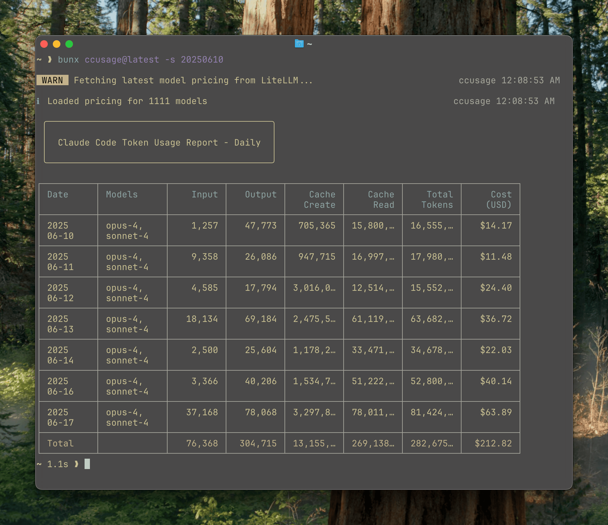

# Cost Management & Monitoring

[← Back: Enterprise Integration](10-enterprise-integration.md) | [Main](../README.md) | [Next: Best Practices →](12-best-practices.md)

---

## Overview

Effective cost management is crucial when using Claude Code at scale. This guide covers token usage monitoring, cost optimization strategies, and tools for tracking expenses.

<p align="center">
  
</p>

## Token Pricing & Usage Limits

### Current Pricing (as of 2025)

| Model | Input Tokens | Output Tokens | Context Window |
|-------|--------------|---------------|----------------|
| **Opus 4** | $15 / 1M tokens | $75 / 1M tokens | 200K tokens |
| **Sonnet 4** | $3 / 1M tokens | $15 / 1M tokens | 200K tokens |

### Plan Limits

| Plan | 5-Hour Window | Daily Average | Best Model |
|------|---------------|---------------|------------|
| **Pro ($20/mo)** | 10-40 prompts | ~50-200 prompts | Sonnet 4 |
| **Max 5x ($100/mo)** | 50-200 prompts | ~250-1,000 prompts | Both |
| **Max 20x ($200/mo)** | 200-800 prompts | ~1,000-4,000 prompts | Both |

## Installing ccusage

The `ccusage` tool provides comprehensive token usage analytics:

```bash
# Install globally
npm install -g ccusage

# Or use without installation
npx ccusage@latest

# Install specific version
npm install -g ccusage@2.1.0
```

## Usage Monitoring

### Basic Commands

```bash
# View today's usage
ccusage

# Live monitoring (updates every second)
ccusage blocks --live

# Daily breakdown
ccusage daily

# Monthly summary
ccusage monthly

# Specific date range
ccusage daily --since 2025-01-01 --until 2025-01-31

# JSON output for processing
ccusage --json > usage-report.json

# Show cost breakdown by model
ccusage daily --breakdown
```

### Understanding the Output

```
┌─────────────────────────────────────────────────────────────────────┐
│ Claude Code Token Usage Report - Daily                              │
├─────────────────────────────────────────────────────────────────────┤
│ Date       Model    Input      Output    Cache     Total     Cost   │
├─────────────────────────────────────────────────────────────────────┤
│ 2025-01-15 opus-4   1,257,773  47,723   15,000    1,320,496 $14.17 │
│ 2025-01-15 sonnet-4 3,358,686  26,686   17,900    3,403,272 $11.48 │
│ 2025-01-14 opus-4   4,545,796  17,796   12,555    4,576,147 $25.46 │
├─────────────────────────────────────────────────────────────────────┤
│ Total                                              9,299,915 $51.11 │
└─────────────────────────────────────────────────────────────────────┘
```

### 5-Hour Billing Windows

```bash
# Monitor current billing window
ccusage blocks --live

# Shows:
# - Current window start/end time
# - Tokens used in window
# - Remaining capacity
# - Estimated cost
```

## Cost Optimization Strategies

### 1. Model Selection Strategy

```bash
# Use Sonnet for routine tasks (5x cheaper)
/model sonnet-4

# Reserve Opus for complex reasoning
/model opus-4

# Automatic switching based on task
claude> For simple code formatting, use Sonnet. 
        For architecture decisions, switch to Opus.
```

### 2. Context Management

```bash
# Clear context regularly to reduce token usage
/clear

# Check current context size
/context

# Save important context to memory before clearing
Memory.store("session-context", importantData)
/clear
```

### 3. Efficient Prompting

```python
# BAD: Verbose, repetitive prompting
claude> I need you to create a function that takes a list of numbers 
        and returns the sum. The function should be called sum_numbers 
        and should handle empty lists by returning 0. Please write this 
        in Python with proper error handling.

# GOOD: Concise, clear prompting
claude> Create a Python function sum_numbers(nums: list) -> float 
        that sums a list, returns 0 for empty lists, with error handling.
```

### 4. Batch Operations

```javascript
// BAD: Multiple individual operations (more tokens)
await claude.ask("Read file1.js");
await claude.ask("Read file2.js");
await claude.ask("Read file3.js");

// GOOD: Single batch operation (fewer tokens)
await claude.ask("Read file1.js, file2.js, and file3.js");
```

### 5. Caching Strategies

```bash
# Enable response caching
export CLAUDE_CACHE_ENABLED=true
export CLAUDE_CACHE_TTL=3600  # 1 hour

# Cache commonly used prompts
Memory.store("templates/api-endpoint", standardAPITemplate);
```

## Advanced Monitoring

### Custom Usage Dashboard

```python
# usage_dashboard.py
import json
import pandas as pd
import matplotlib.pyplot as plt
from datetime import datetime, timedelta

def analyze_usage(days=30):
    # Get usage data
    usage_json = subprocess.check_output(['ccusage', '--json'])
    data = json.loads(usage_json)
    
    # Convert to DataFrame
    df = pd.DataFrame(data['daily'])
    df['date'] = pd.to_datetime(df['date'])
    
    # Cost analysis
    fig, (ax1, ax2, ax3) = plt.subplots(3, 1, figsize=(12, 10))
    
    # Daily costs
    ax1.plot(df['date'], df['cost'], marker='o')
    ax1.set_title('Daily Cost Trend')
    ax1.set_ylabel('Cost ($)')
    
    # Token usage by model
    opus_tokens = df[df['model'] == 'opus-4']['total_tokens']
    sonnet_tokens = df[df['model'] == 'sonnet-4']['total_tokens']
    ax2.bar(df['date'], opus_tokens, label='Opus 4', alpha=0.7)
    ax2.bar(df['date'], sonnet_tokens, label='Sonnet 4', alpha=0.7)
    ax2.set_title('Token Usage by Model')
    ax2.set_ylabel('Tokens')
    ax2.legend()
    
    # Cost efficiency (tokens per dollar)
    df['efficiency'] = df['total_tokens'] / df['cost']
    ax3.plot(df['date'], df['efficiency'], marker='s', color='green')
    ax3.set_title('Cost Efficiency (Tokens per Dollar)')
    ax3.set_ylabel('Tokens/$')
    
    plt.tight_layout()
    plt.savefig('usage_analysis.png')
    
    # Generate report
    total_cost = df['cost'].sum()
    avg_daily_cost = df['cost'].mean()
    total_tokens = df['total_tokens'].sum()
    
    print(f"30-Day Summary:")
    print(f"Total Cost: ${total_cost:.2f}")
    print(f"Average Daily Cost: ${avg_daily_cost:.2f}")
    print(f"Total Tokens: {total_tokens:,}")
    print(f"Projected Monthly Cost: ${avg_daily_cost * 30:.2f}")

analyze_usage()
```

### Real-time Monitoring Script

```bash
#!/bin/bash
# monitor_usage.sh

while true; do
    clear
    echo "=== Claude Code Usage Monitor ==="
    echo "Time: $(date)"
    echo ""
    
    # Current session
    ccusage blocks --current
    
    echo ""
    echo "Today's Summary:"
    ccusage daily --today
    
    echo ""
    echo "Active MCP Servers:"
    claude-flow mcp status
    
    # Alert if approaching limits
    USAGE=$(ccusage --json | jq '.current_window.percentage')
    if (( $(echo "$USAGE > 80" | bc -l) )); then
        echo "⚠️  WARNING: Approaching token limit (${USAGE}%)"
    fi
    
    sleep 60
done
```

## Cost Optimization Patterns

### Pattern 1: Tiered Model Usage

```javascript
// Automatic model selection based on task complexity
function selectModel(task) {
    const complexityIndicators = [
        'architecture', 'design', 'algorithm', 
        'optimization', 'security', 'analysis'
    ];
    
    const useOpus = complexityIndicators.some(indicator => 
        task.toLowerCase().includes(indicator)
    );
    
    return useOpus ? 'opus-4' : 'sonnet-4';
}

// Usage
const model = selectModel("Refactor authentication system");
claude.setModel(model);
```

### Pattern 2: Smart Context Management

```javascript
class ContextManager {
    constructor(maxTokens = 50000) {
        this.maxTokens = maxTokens;
        this.contextSize = 0;
    }
    
    shouldClear() {
        return this.contextSize > this.maxTokens * 0.8;
    }
    
    async manageContext() {
        if (this.shouldClear()) {
            // Save important context
            const summary = await claude.ask("Summarize current context");
            Memory.store("context-summary", summary);
            
            // Clear and restore summary
            await claude.clear();
            await claude.ask(`Previous context summary: ${summary}`);
            
            this.contextSize = summary.length;
        }
    }
}
```

### Pattern 3: Request Batching

```python
class RequestBatcher:
    def __init__(self, batch_size=5, wait_time=2):
        self.batch_size = batch_size
        self.wait_time = wait_time
        self.pending_requests = []
        
    def add_request(self, request):
        self.pending_requests.append(request)
        
        if len(self.pending_requests) >= self.batch_size:
            return self.execute_batch()
            
    def execute_batch(self):
        if not self.pending_requests:
            return []
            
        # Combine requests into single prompt
        combined = "Please handle these tasks:\n"
        for i, req in enumerate(self.pending_requests):
            combined += f"{i+1}. {req}\n"
            
        result = claude.ask(combined)
        self.pending_requests = []
        return result
```

## Budget Management

### Setting Budget Alerts

```bash
# Create budget configuration
cat > ~/.claude/budget.json << EOF
{
  "daily_limit": 50.00,
  "monthly_limit": 1000.00,
  "alerts": {
    "daily_percentage": 80,
    "monthly_percentage": 75
  },
  "notifications": {
    "email": "team@example.com",
    "slack_webhook": "https://hooks.slack.com/..."
  }
}
EOF
```

### Budget Monitoring Script

```python
# budget_monitor.py
import json
import requests
from datetime import datetime

def check_budget():
    # Get current usage
    usage = json.loads(subprocess.check_output(['ccusage', '--json']))
    
    # Load budget config
    with open('~/.claude/budget.json') as f:
        budget = json.load(f)
    
    # Check daily
    today_cost = sum(d['cost'] for d in usage['daily'] 
                     if d['date'] == datetime.now().strftime('%Y-%m-%d'))
    
    if today_cost > budget['daily_limit'] * (budget['alerts']['daily_percentage'] / 100):
        send_alert(f"Daily budget alert: ${today_cost:.2f} of ${budget['daily_limit']:.2f}")
    
    # Check monthly
    month_cost = sum(d['cost'] for d in usage['daily'] 
                     if d['date'].startswith(datetime.now().strftime('%Y-%m')))
    
    if month_cost > budget['monthly_limit'] * (budget['alerts']['monthly_percentage'] / 100):
        send_alert(f"Monthly budget alert: ${month_cost:.2f} of ${budget['monthly_limit']:.2f}")

def send_alert(message):
    # Send to Slack
    requests.post(webhook_url, json={"text": f"🚨 Claude Code Budget Alert: {message}"})
```

## Team Usage Management

### Shared Usage Tracking

```bash
# Export team usage data
ccusage export --team --format csv > team_usage.csv

# Generate team report
ccusage report --team --period month --output team_report.pdf
```

### Department Allocation

```python
# Allocate costs by project
def allocate_costs(usage_data, project_tags):
    """
    Allocate token usage costs to different projects/departments
    """
    allocations = {}
    
    for session in usage_data['sessions']:
        # Extract project from session metadata
        project = extract_project_tag(session)
        
        if project not in allocations:
            allocations[project] = {
                'tokens': 0,
                'cost': 0,
                'sessions': 0
            }
        
        allocations[project]['tokens'] += session['tokens']
        allocations[project]['cost'] += session['cost']
        allocations[project]['sessions'] += 1
    
    return allocations
```

## ROI Calculation

### Measuring Development Acceleration

```python
def calculate_roi(before_metrics, after_metrics):
    """
    Calculate ROI of Claude Code adoption
    """
    # Time savings
    time_saved = before_metrics['avg_feature_time'] - after_metrics['avg_feature_time']
    hourly_rate = 150  # Developer hourly rate
    
    # Cost analysis
    monthly_claude_cost = after_metrics['claude_monthly_cost']
    monthly_time_value = time_saved * hourly_rate * 160  # 160 hours/month
    
    # ROI calculation
    roi = ((monthly_time_value - monthly_claude_cost) / monthly_claude_cost) * 100
    
    return {
        'time_saved_hours': time_saved * 160,
        'value_generated': monthly_time_value,
        'claude_cost': monthly_claude_cost,
        'net_benefit': monthly_time_value - monthly_claude_cost,
        'roi_percentage': roi
    }
```

## Best Practices Summary

1. **Monitor Daily**: Check usage at least once per day
2. **Set Budgets**: Configure alerts at 80% of budget
3. **Optimize Models**: Use Sonnet for 80% of tasks
4. **Manage Context**: Clear when approaching 80% capacity
5. **Batch Requests**: Combine related operations
6. **Track ROI**: Measure time savings vs. costs

## Next Steps

- Learn [Best Practices](12-best-practices.md)
- Review [Command Reference](13-command-reference.md)
- Explore [Examples & Recipes](15-examples-recipes.md)

---

[← Back: Enterprise Integration](10-enterprise-integration.md) | [Main](../README.md) | [Next: Best Practices →](12-best-practices.md)